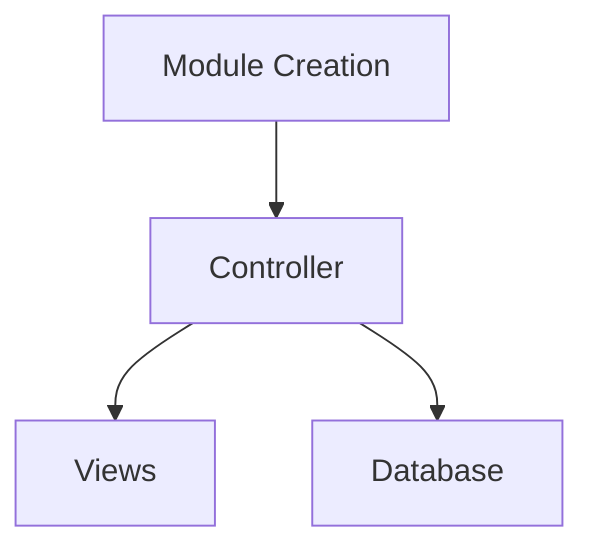

# [Docs](.)

- [Quick Start](quick-start.md)
- [Modules & Controllers](modules-and-controllers.md)
- [Database Strategy](database.md)
- [Request Handling](requests.md)
- [Response Rendering & Output](response.md)
  - [View System](views.md)
  - [Custom Rendering](ad_hoc.md)
- [Client Get & Post](get_and_post.md)

