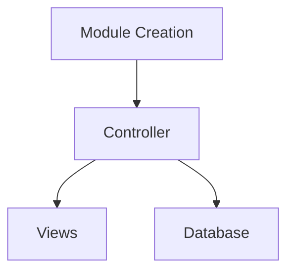

# [Docs](.)

- [Quick Start](quick-start.md)
- [Modules & Controllers](modules-and-controllers.md)
- [Database Strategy](database.md)
- [View System](views.md)
- [Request Handling](requests.md)

```mermaid
graph TD
    A[Module Creation] --> B[Controller]
    B --> C[Views]
    B --> D[Database]
```
