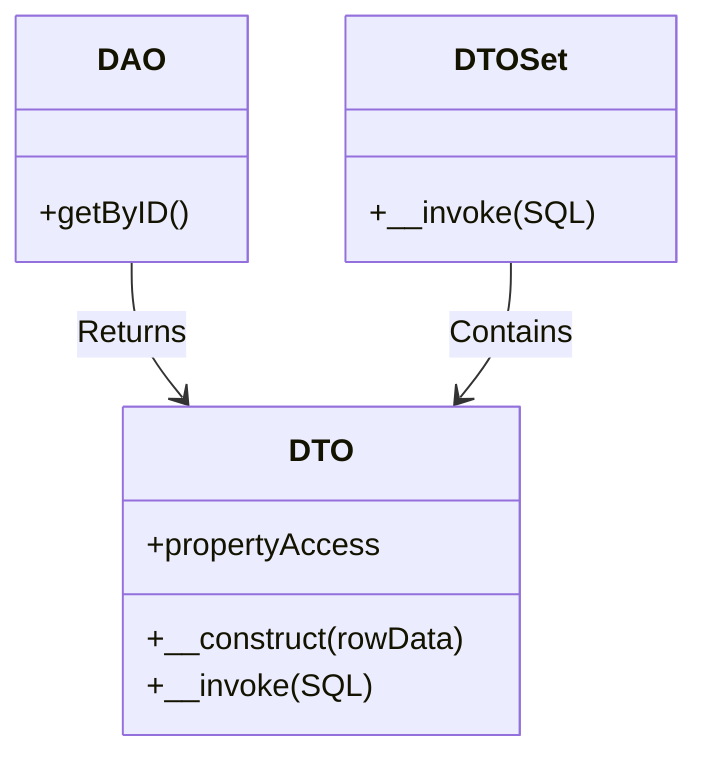

# Database Access with DAO & DTO

DVC provides a clean database abstraction through:
- **DTO** (Data Transfer Objects) - Single records
- **DTO Set** - Collections of DTOs
- **DAO** (Data Access Objects) - CRUD operations

## Quick Start with SQLite

1. **Initialize Configuration**:

   ```bash
   mkdir -p src/data
   cp src/data/defaults-example.json src/data/defaults.json
   ```

2. **Configure SQLite** (`src/data/defaults.json`):

   ```json
   {
     "db_type": "sqlite",
     "sqlite": {
       "fileName": "storage/database.db"
     }
   }
   ```

## Core Concepts

### 1. DTO (Single Record)

```php
// Auto-hydrated from database rows
$user = (new bravedave\dvc\dto)('SELECT * FROM users WHERE id = 1');
echo $user->name; // Access fields as properties
```

### 2. DTO Set (Record Collections)

```php
$users = (new bravedave\dvc\dtoSet)('SELECT id, name FROM users');

foreach ($users as $user) {
    echo $user->name; // Each item is a DTO
}
```

### 3. DAO (Table Gateway)

```php
class users extends bravedave\dvc\dao {
    protected $_db_name = 'users';
    protected $template = dto\users::class;
}

// Usage
$usersDao = new users();
```

## CRUD Operations

### Create

```php
$newId = $usersDao->insert([
    'name' => 'Dave',
    'email' => 'dave@example.com'
]);
```

### Read
```php
// Get single record
$user = $usersDao->getByID(3);

// Get all records
$allUsers = $usersDao->getAll();
```

### Update
```php
// Update by ID
$usersDao->updateByID(
    ['name' => 'Dingo'], // Fields to update
    3                   // Record ID
);
```

### Delete
```php
$usersDao->delete(3); // By ID
```

## Advanced Usage

### Custom DTO Classes
```php
namespace dto;

class users extends bravedave\dvc\dto {
    public function displayName() {
        return "User: {$this->name}";
    }
}
```

## Why This Architecture?

1. **DTO Benefits**:

   - Type-safe record access
   - Custom business logic methods
   - Prevents "array soup" in code

2. **DAO Advantages**:

   - Single point of table access
   - Built-in CRUD operations
   - Easy to mock for testing

3. **SQLite First**:

   - Zero-config for development
   - File-based simplicity
   - Scales to MariaDB when needed

---

1. **DAO/DTO Relationship**:


