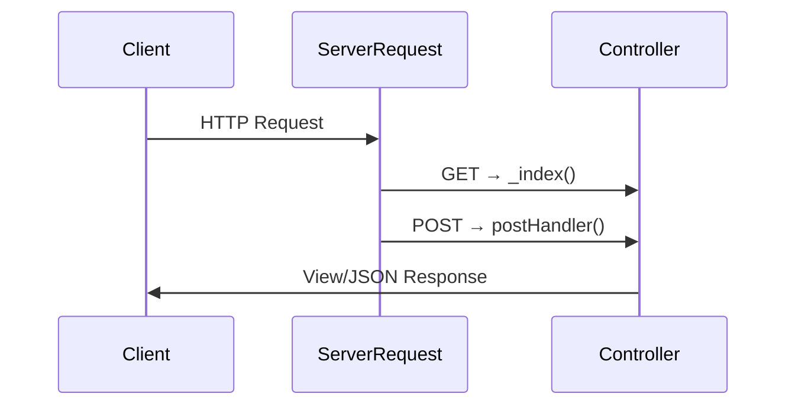
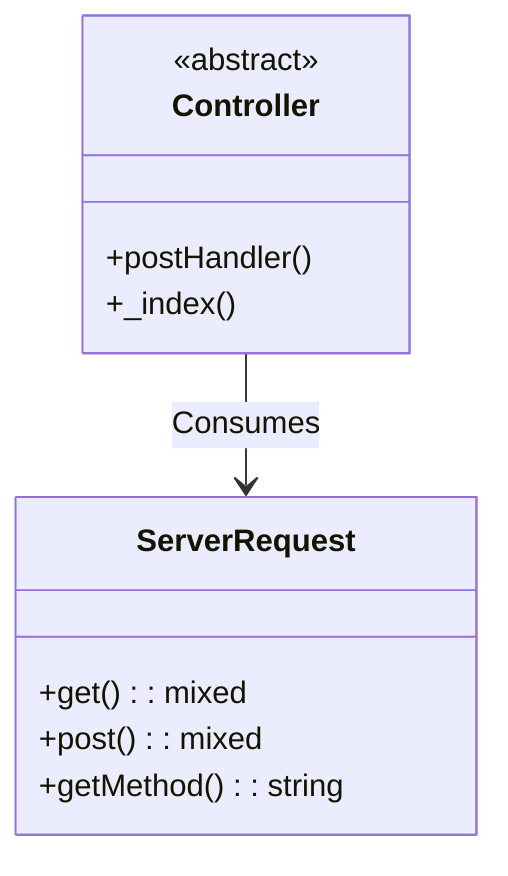

# Request Handling in DVC

DVC provides a streamlined HTTP interaction model inspired by classic ASP's core objects, but with modern PSR-7 compatibility through `bravedave\dvc\ServerRequest`.

## Core Components

| Object          | Purpose                              | Equivalent ASP Object |
|-----------------|--------------------------------------|-----------------------|
| `ServerRequest` | Immutable HTTP request wrapper       | `Request`             |
| `Response`      | Output handling (implicit in views)  | `Response`            |
| `Session`       | `$_SESSION` wrapper (coming soon)    | `Session`             |

## Key Features

### 1. ServerRequest (PSR-7 Lite)

```php
use bravedave\dvc\ServerRequest;

$request = new ServerRequest();

// GET/POST access
$id = $request->getQueryParam('id'); 
$name = $request('name');

// PSR-7 methods
$uri = $request->getUri();
```

### 2. POST/GET Separation

Controllers automatically split handling:

```php
protected function _index() {
   // GET /example
}

protected function postHandler() {
  // POST /example
  $request = new ServerRequest();
  $action = $request('action')
  return match($action) {
    'save' => $this->saveData($request),
    default => $this->jsonResponse(['error' => 'Invalid action'])
  };
}
```

### 3. API Responses

```php
// JSON output
protected function jsonResponse(array $data) {
   header('Content-Type: application/json');
   echo json_encode($data);
   exit;
}

// Usage in postHandler:
return $this->jsonResponse(['status' => 'success']);
```

## Why This Approach?

1. **Familiar ASP-Like Flow**  
   - Clear separation of input/output
   - Simple `$_GET/$_POST` replacement via `ServerRequest`

2. **PSR-7 Compatibility**  
   - Interoperable with Nyholm/PSR-7 components
   - Can evolve into full PSR-7 if needed

3. **Zero Config**  
   - Works out of the box like classic ASP
   - No complex DI containers required

---

### Suggested Diagrams

#### 1. Request Lifecycle



#### 2. Class Relationships



---

### Migration Tip

For Nyholm/PSR-7 users:

```php
// Want full PSR-7? Wrap it:
use Nyholm\Psr7\ServerRequest;

$psr7Request = new ServerRequest(
    $_SERVER['REQUEST_METHOD'],
    $_SERVER['REQUEST_URI'],
    getallheaders(),
    fopen('php://input', 'r')
);

// Convert to DVC's simplified version:
$dvcRequest = new \bravedave\dvc\ServerRequest($psr7Request);
```
