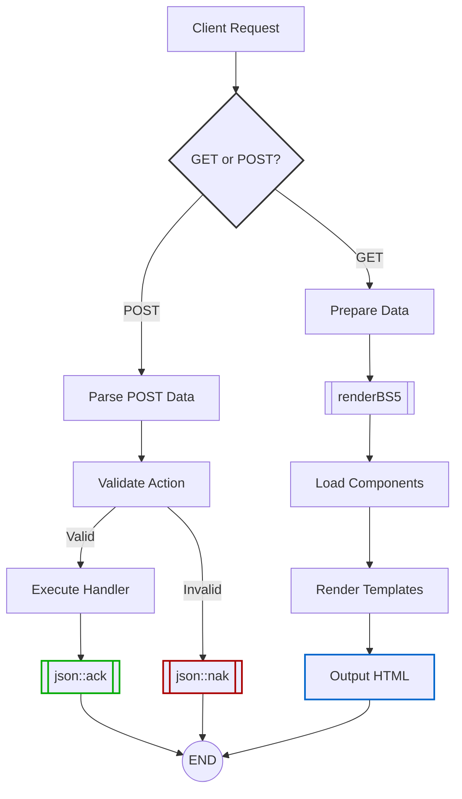

# DVC - Response

## DVC Framework Documentation: Responding to GET & POST Requests

The DVC framework streamlines web interactions by embracing **HTTP GET/POST conventions** for distinct purposes:

- **GET**: Retrieve data or render views (safe, idempotent).
- **POST**: Modify server state (create/update/delete actions).

Below, we outline how to handle both paradigms, including JSON APIs (POST) and HTML rendering (GET).



## 1. POST Requests: JSON API Responses

POST operations are used for actions that change server state. The framework standardizes responses using `json::ack()` (success) and `json::nak()` (failure).

### Response Methods

| Method              | Purpose                          | Example Response (JSON)                          |
|---------------------|----------------------------------|--------------------------------------------------|
| `json::ack(message, data)` | Success acknowledgment          | `{ "response": "ack", "description": "Task updated", "data": { ... } }` |
| `json::nak(message, data)` | Failure notification            | `{ "response": "nak", "description": "Invalid action", "data": null }` |

#### Usage Example

```php
public function postHandler() {
  $action = $this->post['action'] ?? 'default';
  match ($action) {
    'todo-update' => $this->handleTodoUpdate(),
    default       => json::nak('Unrecognized action')
  };
}

private function handleTodoUpdate() {
  $id = (int)($this->post['id'] ?? 0);
  $description = sanitize($this->post['description'] ?? '');

  if (!$id || empty($description)) {
    json::nak('Invalid input');
  }

  // Update database, then:
  json::ack('Todo updated', ['id' => $id, 'description' => $description]);
}
```

#### Behavior

- Automatically sets `Content-Type: application/json`.
- Terminates script execution after sending the response.

---

## 2. GET Requests: HTML Page Rendering

GET requests are used to load views. The `renderBS5()` method assembles Bootstrap 5-styled pages with a modular structure.

### Workflow

#### Step 1: Prepare Data

Assign data to `$this->data` for access in views:

```php
$this->data = (object)[
  'title' => 'Task List',
  'tasks' => Todo::fetchAll()
];
```

#### Step 2: Define Layout with `renderBS5()`

Specify components (navbar, main, footer, etc.) as closures:

```php
$this->renderBS5([
  'navbar' => fn() => $this->load('navbar'), // Loads views/navbar.php
  'main'   => fn() => $this->load('task-list'),
  'footer' => fn() => $this->load('footer')
]);
```

#### Step 3: Template Structure

Views (e.g., `task-list.php`) use `$this->data` via `extract()`:

```php
<div class="container">
  <h1><?= $title ?></h1>
  <ul>
    <?php foreach ($tasks as $task): ?>
      <li><?= htmlspecialchars($task->description) ?></li>
    <?php endforeach; ?>
  </ul>
</div>
```

### Rendering Behavior

- **Immediate Output**: `renderBS5()` finalizes rendering *during its execution*.
- **Automatic Headers**: Sets `Content-Type: text/html` and sends headers.
- **Component Order**: Renders sections as:

  ```html
  <html>
    <navbar>...</navbar>
    <main>...</main>
    <footer>...</footer>
  </html>
  ```

---

## 3. Key Design Principles

1. **Convention Over Configuration**:
   - POST → JSON, GET → HTML.
   - No complex routing—actions map directly to handlers.

2. **Separation of Concerns**:
   - Controllers handle logic.
   - Views focus on presentation.

3. **Predictability**:
   - JSON responses terminate execution.
   - HTML rendering completes in one step (`renderBS5()`).

4. **Security**:
   - Always sanitize inputs (e.g., `(int)`, `htmlspecialchars()`).

---

## Example End-to-End Flow

### POST Request (API)

1. Client sends:

   ```javascript
   _.api('/tasks', {
     action: 'todo-update',
     id: 123,
     description: 'New task'
   });
   ```

2. Server responds:

   ```json
   {
     "response": "ack",
     "description": "Todo updated",
     "data": { "id": 123, "description": "New task" }
   }
   ```

### GET Request (Page)

1. Client navigates to `/tasks`.
2. Server renders:

   ```html
   <html>
     <navbar><!-- Navigation --></navbar>
     <main>
       <div class="container">
         <h1>Task List</h1>
         <ul>
           <li>New task</li>
         </ul>
       </div>
     </main>
     <footer><!-- Footer --></footer>
   </html>
   ```

---

### Key Takeaway

DVC's approach prioritizes "build, build, build" simplicity - focus on assembling data and components, and let the framework handle the rest. 🛠️

This approach ensures **clarity**, **maintainability**, and **developer productivity**—whether you’re building APIs or crafting user interfaces. 🚀
