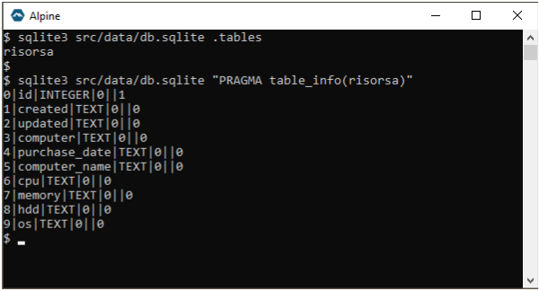

# Risorsa - Asset Management

###### <navbar>[Docs](/docs/) | Risorsa</navbar>

**How to create a PHP module**<br>
*this guide uses Bootstrap version 5*

### Goal

Create a module to record computer assets in a business to record:

1. Computer
1. Purchase Date
1. Computer Name
1. CPU
1. Memory
1. HDD
1. OS

### Recipe

1. Follow the Getting Started guide at <https://github.com/bravedave/dvc>
   * the rest of this tutorial assumes
     * the getting stated has been run successfully
     * the namespace root is ***src/app***

**note**

the Getting Started guide means you can see the app at in your browser at <http://localhost:8080/>.

### Creating an application

The code is being created within the *"risorsa"* namespace, and a *DVC* Controller is being created to directly reference it.

In DVC, controllers are located in the "src/controller" directory, and the specific controller being created in this case is also named *"risorsa"*.

1. Create a folder for the namespace at *src/app/risorsa*
2. Create a folder at *src/controller*
3. Create the referencing controller
   * Create a file *src/controller/risorsa.php*

```php
<?php
// file: src/controller/risorsa.php
class risorsa extends risorsa\controller {}
```

this points us into our namespace and we are ready to code out application...

#### Create a config

>a central config file is useful for specifying constants

* Create a file src/risorsa/config.php

```php
<?php
// file: src/risorsa/config.php
namespace risorsa;

class config extends \config {  // noting: config extends global config classes
  const label = 'Risorsa';  // general label for application

}
```

#### Create the controller

* create a file *src/risorsa/controller.php*

```php
<?php
// file: src/risorsa/controller.php
namespace risorsa;

use bravedave\dvc\ServerRequest;
use strings;

class controller extends \Controller {
  protected function _index() {
    // these lines is temporary
    print 'hello from risorsa ..';
    return;
    // these lines is temporary

    $this->title = config::label;

    $this->renderBS5([
      'aside' => fn () => $this->load('blank'),
      'main' => fn () => $this->load('blank')
    ]);
  }

  protected function before() {
    parent::before();

    $this->viewPath[] = __DIR__ . '/views/';  // location for module specific views
  }

  protected function postHandler() {

    $request = new ServerRequest;
    $action = $request('action');

    parent::postHandler();
  }
}
```
>Ensure ServerRequest is referenced at the top of the controller just after the namespace declaration

>the app now runs at <http://localhost:8080/risorsa> and says *hello from risorsa ..*<br>
**special note : the url is /risorsa**

* remove the lines between *"these lines is temporary"* inclusive of those lines, the app will still run, you have a navbar, footer and blank views .. a clean start

>you can create a navbar and footer, it's not required as this is a module, so a navbar and footer is probably more global than this, to create one, create a file at *src/app/views/navbar-default.php* and *src/app/views/footer.php* -  and use the bootstrap examples

so ... to the app

#### Create an Index page

* Create a folder at *src/risorsa/views*
* Add a file *src/risorsa/views/index.php*

```php
<?php
// file: src/risorsa/views/index.php
namespace risorsa;  ?>

<h6 class="mt-1">Risorsa</h6>
```

1. Modify the controllers secondary view to load 'index'
    * at about line 13 of *src/risorsa/controller.php*

```php
  'aside' => fn () => $this->load('index'),
```

#### Connect to a database

>Note the data folder is created with a .gitignore file, do not upload the data folder to a public repository
>To save data we will need a database, there are many... *DVC* supports SQLite, mysql and mariadb.

* rename src/data/defaults-sample.json to src/data/defaults.json
  * db_type is the important line - noting it is sqlite, refresh your page and the data file *db.sqlite* is created in the data folder

#### Design a Table

>*The goal is to maintain a table of computer assets, previously we noted the information required to be stored. The objective is to create a table definition and use DVC's builtin table maintenance system*

* When thinking database/table/records, *DVC* uses DAO and DTO.
  * **DAO (Data Access Object)** is a design pattern that abstracts data access implementation.
  * **DTO (Data Transfer Object)** is a simple object that transfers data between different parts of an application, allowing them to communicate with each other, regardless of location.
  * DAO is used for data access, and DTO is used for data transfer.

* Create the folders src/risorsa/dao, and src/risorsa/dao/db
* Create a file src/risorsa/dao/db/risorsa.php

```php
<?php
// file: src/risorsa/dao/db/risorsa.php

$dbc = \sys::dbCheck('risorsa');

/**
 * note:
 *  id, autoincrement primary key is added to all tables - no need to specify
 *  field types are MySQL and are converted to SQLite equivalents as required
 */

$dbc->defineField('created', 'datetime');
$dbc->defineField('updated', 'datetime');

$dbc->defineField('computer', 'varchar');
$dbc->defineField('purchase_date', 'varchar');
$dbc->defineField('computer_name', 'varchar');
$dbc->defineField('cpu', 'varchar');
$dbc->defineField('memory', 'varchar');
$dbc->defineField('hdd', 'varchar');
$dbc->defineField('os', 'varchar');

$dbc->check();  // actually do the work, check that table and fields exist
```

#### Initiate Auto Table Maintenance

>*DVC*'s table maintenance is simple, it can add fields that are missing. It maintains a version, of if you increment the version, it checks that table. It can maintain indexes also.

* Find and copy the maintenance file into the dao folder, adjust the namespace

```bash
cp vendor/bravedave/dvc/tests/app/dao/dbinfo.php src/app/risorsa/dao/
```

```php
<?php
// file: src/risorsa/dao/dbinfo.php
namespace risorsa\dao;

use bravedave\dvc\dbinfo as dvcDbInfo;

class dbinfo extends dvcDbInfo {
  /*
  * it is probably sufficient to copy this file into the <application>/app/dao folder
  *
  * from there store you structure files in <application>/dao/db folder
  */
  protected function check() {
    parent::check();
    parent::checkDIR(__DIR__);
  }
}
```

>all that is required is to call the checking routine, this will create any tables from template files in the db folder. it will also maintain a file in the data folder of table versions (src/data/db_version.json)
>Do this as part of your *config*

* modify file src/risorsa/config.php

```php
<?php
// file : src/risorsa/config.php
namespace risorsa;

class config extends \config {  // noting: config extends global config classes
  const risorsa_db_version = 1;

  const label = 'Risorsa';  // general label for application

  static function risorsa_checkdatabase() {
    $dao = new dao\dbinfo;
    // $dao->debug = true;
    $dao->checkVersion('risorsa', self::risorsa_db_version);
  }
}
```

* Add a checking routine to the controller to call the checking routine regularly

> before is a routine of the controller class, it's called at the end of __construct, note we have added the location of module specific views, we use that later in edit and matrix reporting

```php
// file : src/risorsa/controller
  protected function before() {
    config::risorsa_checkdatabase();  // add this line
    parent::before();

    $this->viewPath[] = __DIR__ . '/views/';  // location for module specific views
  }
```

refresh the browser at <http://localhost:8080/risorsa> it will create the table

>Tip : To see the table directly from the command line, use the sqlite3 utility<br>
>

almost done with the database, two more files will round this out

##### DTO - Data Transition Object

>The DTO will allow us to have a blank record - it contains default values - we will use this to create new records

* create a folder src/risorsa/dao/dto
* create a file src/risorsa/dao/dto/risorsa.php

```php
<?php
// file: src/risorsa/dao/dto/risorsa.php
namespace risorsa\dao\dto;

use bravedave\dvc\dto;

class risorsa extends dto {
  public $id = 0;
  public $created = '';
  public $updated = '';

  public $computer = '';
  public $purchase_date = '';
  public $computer_name = '';
  public $cpu = '';
  public $memory = '';
  public $hdd = '';
  public $os = '';
}
```

##### DAO - Data Access Object

>the dao has a few default action *getByID( $id)* for instance returns a dto of the given id

* create a file src/risorsa/dao/risorsa.php

```php
<?php
// file : src/risorsa/dao/risorsa.php
namespace risorsa\dao;

use bravedave\dvc\dao;

class risorsa extends dao {
  protected $_db_name = 'risorsa';
  protected $template = dto\risorsa::class;

  public function Insert($a) {
    $a['created'] = $a['updated'] = self::dbTimeStamp();
    return parent::Insert($a);
  }

  public function UpdateByID($a, $id) {
    $a['updated'] = self::dbTimeStamp();
    return parent::UpdateByID($a, $id);
  }
}
```

that wraps up storage, lets create the add/edit modal, and a report matrix

#### Control the execution of adding a record

>Using the MVC convention, the controller will organise data and call the view

* create an ***edit*** routine in the controller, add this function to src/risorsa/controller

```php
// file : src/risorsa/controller.php
  public function edit($id = 0) {
    // tip : the structure is available in the view at $this->data->dto
    $this->data = (object)[
      'title' => $this->title = config::label,
      'dto' => new dao\dto\risorsa
    ];

    if ($id = (int)$id) {
      $dao = new dao\risorsa;
      $this->data->dto = $dao->getByID($id);
      $this->data->title .= ' edit';
    }

    $this->load('edit');
  }
```

#### Create an Add record modal

>In this section we create a Bootstrap Modal dialog to add/edit a record, the structure of the data is defined earlier in the dto section, and the dto will be provided to the view
>*Note : we will be using javascript/ajax to post the data, the merit is more apparent when contructing the matrix..*

* create a file src/risorsa/views/edit.php

```php
<?php
// file : src/risorsa/views/edit.php
namespace risorsa;

use strings, theme;

// note: $dto and $title into the environment ?>
<form id="<?= $_form = strings::rand() ?>" autocomplete="off">

  <input type="hidden" name="action" value="risorsa-save">
  <input type="hidden" name="id" value="<?= $dto->id ?>">

  <div class="modal fade" tabindex="-1" role="dialog" id="<?= $_modal = strings::rand() ?>" aria-labelledby="<?= $_modal ?>Label" aria-modal="true" aria-hidden="true">
    <div class="modal-dialog modal-lg modal-dialog-centered" role="document">
      <div class="modal-content">

        <div class="modal-header <?= theme::modalHeader() ?>">
          <h5 class="modal-title" id="<?= $_modal ?>Label"><?= $this->title ?></h5>
          <button type="button" class="btn-close" data-bs-dismiss="modal" aria-label="Close"></button>
        </div>

        <div class="modal-body">

          <!-- --[computer]-- -->
          <div class="row g-2">

            <div class="col-md-3 col-form-label">computer</div>
            <div class="col mb-2">

              <input type="text" class="form-control" name="computer" value="<?= $dto->computer ?>">
            </div>
          </div>

          <!-- --[purchase_date]-- -->
          <div class="row g-2">

            <div class="col-md-3 col-form-label text-truncate">purchase date</div>
            <div class="col mb-2">

              <input type="date" class="form-control" name="purchase_date" value="<?= $dto->purchase_date ?>">
            </div>
          </div>

          <!-- --[computer_name]-- -->
          <div class="row g-2">

            <div class="col-md-3 col-form-label text-truncate">computer name</div>
            <div class="col mb-2">

              <input type="text" class="form-control" name="computer_name" value="<?= $dto->computer_name ?>">
            </div>
          </div>

          <!-- --[cpu]-- -->
          <div class="row g-2">

            <div class="col-md-3 col-form-label text-truncate">cpu</div>
            <div class="col mb-2">

              <input type="text" class="form-control" name="cpu" value="<?= $dto->cpu ?>">
            </div>
          </div>

          <!-- --[memory]-- -->
          <div class="row g-2">

            <div class="col-md-3 col-form-label text-truncate">memory</div>
            <div class="col mb-2">

              <input type="text" class="form-control" name="memory" value="<?= $dto->memory ?>">
            </div>
          </div>

          <!-- --[hdd]-- -->
          <div class="row g-2">

            <div class="col-md-3 col-form-label text-truncate">hdd</div>
            <div class="col mb-2">

              <input type="text" class="form-control" name="hdd" value="<?= $dto->hdd ?>">
            </div>
          </div>

          <!-- --[os]-- -->
          <div class="row g-2">

            <div class="col-md-3 col-form-label text-truncate">os</div>
            <div class="col mb-2">

              <input type="text" class="form-control" name="os" value="<?= $dto->os ?>">
            </div>
          </div>
        </div>

        <div class="modal-footer">

          <button type="button" class="btn btn-outline-secondary" data-bs-dismiss="modal">close</button>
          <button type="submit" class="btn btn-primary">Save</button>
        </div>
      </div>
    </div>
  </div>
  <script>
    (_ => {
      const form = $('#<?= $_form ?>');
      const modal = $('#<?= $_modal ?>');
      
      modal.on('shown.bs.modal', () => {

        form.on('submit', function(e) {
          let _form = $(this);
          let _data = _form.serializeFormJSON();

          _.post({
            url: _.url('<?= $this->route ?>'),
            data: _data,
          }).then(d => {

            if ('ack' == d.response) {

              modal.trigger('success');
              modal.modal('hide');
            } else {

              _.growl(d);
            }
          });

          // console.table( _data);

          return false;
        });
      });
    })(_brayworth_);
  </script>
</form>
```

##### Handle the save

>modify the controller's postHandler to handle the save

* Modify src/risorsa/controller.php

```php
  protected function postHandler() {

    $request = new ServerRequest;
    $action = $request('action');

    if ('risorsa-save' == $action) {
      $a = [
        'computer' => $request('computer'),
        'purchase_date' => $request('purchase_date'),
        'computer_name' => $request('computer_name'),
        'cpu' => $request('cpu'),
        'memory' => $request('memory'),
        'hdd' => $request('hdd'),
        'os' => $request('os')

      ];

      $dao = new dao\risorsa;
      if ($id = (int)$request('id')) {

        $dao->UpdateByID($a, $id);
      } else {
        $dao->Insert($a);
      }
      json::ack($action); // json return { "response": "ack", "description" : "risorsa-save" }
    } else {
      parent::postHandler();
    }
  }
```

>This will actually introduce an error, ServerRequest and json of json::ack will not be found, add the reference at the top of the controller, just after the namespace declaration

```php
<?php
/**
 * file src/risorsa/controller.php
 */
namespace risorsa;

use bravedave\dvc\{json, ServerRequest}; // add this line
use strings;

class controller extends \Controller {
```

##### Allow the add control to trigger the modal/form to add a new record

* modify the click event of the add control

```php
<?php
// file: src/risorsa/views/index.php
namespace risorsa;

use strings;  ?>

<h6 class="mt-1"><?= config::label ?></h6>

<ul class="nav flex-column">
  <li class="nav-item">
    <a class="nav-link" href="#" id="<?= $_uidAdd = strings::rand() ?>"><i class="bi bi-plus-circle"></i> new</a>
  </li>
</ul>
<script>
  (_ => $(document).ready(() => {
    $('#<?= $_uidAdd ?>').on('click', function(e) {
      e.stopPropagation();
      e.preventDefault();

      /**
       * note:
       * on success of adding new, tell the document there
       * was a new record, will be used by the matrix
       *  */
      _.get.modal(_.url('<?= $this->route ?>/edit'))
        .then(m => m.on('success', e => $(document).trigger('risorsa-add-new')));

      console.log('click');

    });

  }))(_brayworth_);
</script>
```

Right now the form will add a record to the database, you can view it using SQL - just reporting to go !

#### Create an Report Matrix

>The goal in this section is to Use a controller to request some modelling of data, and supply that modelled data to a view - and it will do that when requested by the default function of the controller... *_index*

##### Request some Modelled Data

* modify the file src/risorsa/dao/risorsa.php to include the getMatrix function

```php
<?php
// file: src/risorsa/dao/risorsa.php
  public function getMatrix() : array {

    return (new dtoSet)('SELECT * FROM `risorsa`'); // an array of records
  }
```

>as with the controller earlier, this will introduce an error, dtoSet will not be found, add the reference at the top of the class, just after the namespace declaration

```php
<?php
// file : src/risorsa/dao/risorsa.php
namespace risorsa\dao;

use bravedave\dvc\dao;
use bravedave\dvc\dtoSet;  // add this line

class risorsa extends dao {
```

* modify the controller to supply the data, add this logic into the posthandler

>note that there is 2 logics here, a get-by-id, and a get-matrix logic<br>
>the data is going to be requested using ajax ...there are a number of advantages
>
>1. The Page will load faster - because it is smaller
>2. When modifying data, we can update it without reloading the page - once we exceed 10-20 records this becomes significant improvement to the UI.

```php
<?php
/**
 * file : src/risorsa/controller.php
 * */
  protected function postHandler() {

    $request = new ServerRequest;
    $action = $request('action');

    if ('get-by-id' == $action) {
      /*
        (_ => {
          _.post({
            url: _.url('risorsa'),
            data: {
              action: 'get-by-id',
              id : 1
            },
          }).then(d => 'ack' == d.response ? console.log(d.data) : _.growl(d));
        })(_brayworth_);
       */
      if ($id = (int)$request('id')) {
        $dao = new dao\risorsa;
        if ($dto = $dao->getByID($id)) {
          json::ack($action)
            ->add('data', $dto);
        } else {
          json::nak($action);
        }
      } else {
        json::nak($action);
      }
    } elseif ('get-matrix' == $action) {
      /*
        (_ => {
          _.post({
            url: _.url('risorsa'),
            data: {
              action: 'get-matrix'
            },
          }).then(d => 'ack' == d.response? console.table(d.data): _.growl(d));
        })(_brayworth_);
       */
      $dao = new dao\risorsa;
      json::ack($action)
        ->add('data', $dao->getMatrix());
    } elseif ('risorsa-save' == $action) {
    // ... note, we inserted this at the start and have changed the if/else to logically continue ...
    // ... more code ...
```

>**read the above carefully**, we modified the logic on the risorsa-save action,<br>
we also inserted a test routine which can be executed from the console

##### Create the View

* create the file src/risorsa/views/matrix.php

```php
<?php
// file: src/risorsa/views/matrix.php
namespace risorsa;

use strings;

?>
<div class="table-responsive">
  <table class="table table-sm" id="<?= $_uidMatrix = strings::rand() ?>">
    <thead class="small">
      <tr>
        <td>computer</td>
        <td>purchase date</td>
        <td>computer name</td>
        <td>cpu</td>
        <td>memory</td>
        <td>hdd</td>
        <td>os</td>
      </tr>
    </thead>

    <tbody></tbody>

  </table>
</div>
<script>
  (_ => {

    const edit = function() {
      let _me = $(this);
      let _dto = _me.data('dto');

      _.get.modal(_.url(`<?= $this->route ?>/edit/${_dto.id}`))
        .then(m => m.on('success', e => _me.trigger('refresh')));

    };

    const localeDate = s => {
      if (_.isDateValid(s)) {
        let d = new Date(s);
        return d.toLocaleDateString();
      }
      return s;
    };

    const matrix = data => {
      let table = $('#<?= $_uidMatrix ?>');
      let tbody = $('#<?= $_uidMatrix ?> > tbody');

      tbody.html('');
      $.each(data, (i, dto) => {
        $(`<tr class="pointer">
          <td class="js-computer">${dto.computer}</td>
          <td class="js-purchase_date">${localeDate(dto.purchase_date)}</td>
          <td class="js-computer_name">${dto.computer_name}</td>
          <td class="js-cpu">${dto.cpu}</td>
          <td class="js-memory">${dto.memory}</td>
          <td class="js-hdd">${dto.hdd}</td>
          <td class="js-os">${dto.os}</td>
        </tr>`)
          .data('dto', dto)
          .on('click', function(e) {
            e.stopPropagation();
            e.preventDefault();

            $(this).trigger('edit');

          })
          .on('edit', edit)
          .on('refresh', refresh)
          .appendTo(tbody);

      });

    };

    const refresh = function(e) {
      e.stopPropagation();

      let _me = $(this);
      let _dto = _me.data('dto');

      _.post({
        url: _.url('<?= $this->route ?>'),
        data: {
          action: 'get-by-id',
          id: _dto.id
        },

      }).then(d => {
        if ('ack' == d.response) {
          $('.js-computer', _me).html(d.data.computer);
          $('.js-purchase_date', _me).html(d.data.purchase_date);
          $('.js-computer_name', _me).html(d.data.computer_name);
          $('.js-cpu', _me).html(d.data.cpu);
          $('.js-memory', _me).html(d.data.memory);
          $('.js-hdd', _me).html(d.data.hdd);
          $('.js-os', _me).html(d.data.os);

        } else {
          _.growl(d);

        }
      });
    };

    $('#<?= $_uidMatrix ?>')
      .on('refresh', function(e) {
        _.post({
          url: _.url('<?= $this->route ?>'),
          data: {
            action: 'get-matrix'
          },
        }).then(d => {
          if ('ack' == d.response) {
            matrix(d.data);
          } else {
            _.growl(d);
          }
        });

      });

    $(document).on('risorsa-add-new', e => $('#<?= $_uidMatrix ?>').trigger('refresh'));
    $(document).ready(() => $('#<?= $_uidMatrix ?>').trigger('refresh'));

  })(_brayworth_);
</script>
```

##### Load the View

* Modify the src/risorsa/controller.php to load the matrix view

```php
  // file: src/risorsa/controller.php
  protected function _index() {

    $this->title = config::label;

    /**
     * renderBS5 wraps the page in <html><body> tags
     * and load the bootstrap5 css/js
     */
    $this->renderBS5([
      'aside' => fn () => $this->load('index'),
      'main' => fn () => $this->load('matrix')
    ]);
  }
```

>the app now runs at <http://localhost:8080/risorsa> ... yay !
