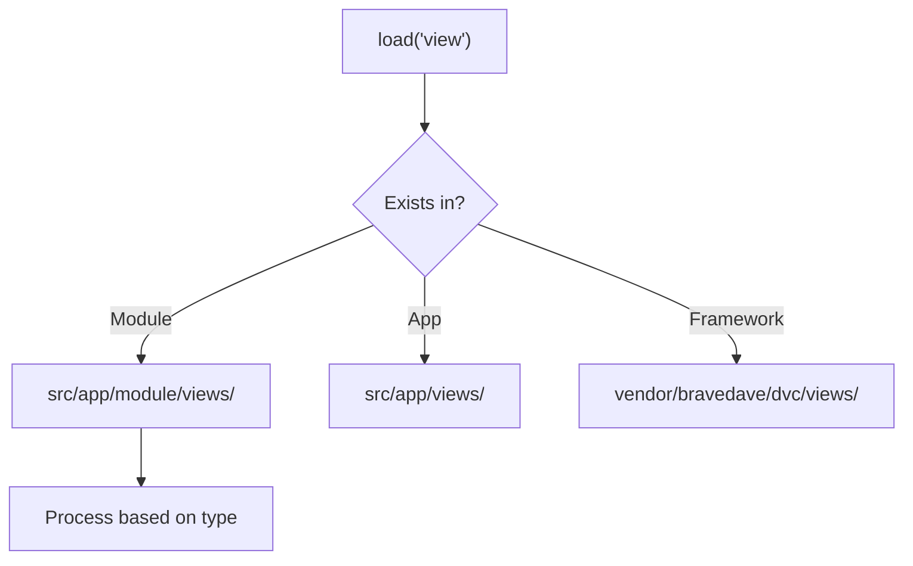

# Views in DVC

DVC provides a flexible view system with support for multiple file types and predictable lookup paths.

## View File Types

| Type   | Processing                    | Variables        | Best For             |
|--------|-------------------------------|------------------|----------------------|
| `.php` | Executed as PHP               | `extract($data)` | Dynamic content      |
| `.md`  | Rendered as HTML (CommonMark) | None             | Static documentation |
| `.html`| Output raw*                   | None             | Static templates     |

> \* HTML files can contain PHP if needed, but this is not recommended

## View Lookup Paths

Views are discovered in this order:

1. **Module Views**  
   `src/app/{module}/views/` (Added via controller's `before()`)
2. **Application Views**  
   `src/app/views/` (Global templates)
3. **Framework Views**  
   `vendor/bravedave/dvc/views/` (Fallback defaults)

Example controller setup:

```php
protected function before() {
    parent::before();
    $this->viewPath[] = __DIR__ . '/views/'; // Module views
}
```

## Loading Views

### PHP Views

```php
// Controller
$this->data = [
    'title' => 'Welcome',
    'users' => $userDTOs
];
$this->load('dashboard.php');

// views/dashboard.php
<h1><?= $title ?></h1>
<ul>
  <?php foreach ($users as $user): ?>
    <li><?= htmlspecialchars($user->name) ?></li>
  <?php endforeach ?>
</ul>
```

### Markdown Views

```php
// Controller
$this->load('docs/intro.md');

// views/docs/intro.md
# Documentation
Static content with **CommonMark** support
```

## Best Practices

1. **PHP Views**  
   - Use for dynamic content  
   - Always escape output (`htmlspecialchars()`)
   - Keep business logic in controllers

2. **Markdown Views**  
   - Ideal for static content  
   - Supports GitHub-flavored Markdown  
   - No variable interpolation

3. **Organization**  

   ```code
   src/app/
   ├── blog/
   │   └── views/
   │       ├── post.php    # Module-specific
   │       └── list.php
   └── views/
       ├── navbar.php     # Global
       └── footer.php
   ```

## Advanced Notes

- **No Template Engine**  
  DVC deliberately avoids `{{variables}}` syntax for simplicity  
- **Security**  
  The `_protectedLoad` method uses isolated variable scoping  
- **Performance**  
  MD files are compiled once (with caching via CommonMark)

---

## View Resolution Flow


