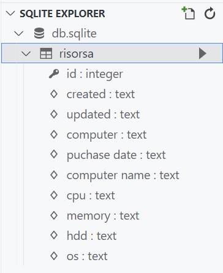

# Risorsa - Asset Management

## How to create a PHP module

>Preamble - this guide uses Bootstrap version 4, it is recommended when starting new projects to use version 5

### Goal

Create a module to record computer assets in a business. We want to record:

1. Computer
1. Puchase Date
1. Computer Name
1. CPU
1. Memory
1. HDD
1. OS

<em>
Assuming Installed and running - suggest WSL

1. PHP
1. Composer

and using *bravedave/dvc*
</em>

### Recipe

1. Create a new project `composer create-project bravedave/mvp risorsa`
1. Open that folder with VS Code and start your terminal, the working directory will be *risorsa*
1. Add dvc `composer req bravedave/dvc`
1. clean up (we don't need these)
   * `rm -fr src/app/home src/app/template`
   * `rm -f src/app/slim.php src/app/launcher.php`
1. modify www/_mvp.php to point to ***application::run***, not *launcher::run* ..
1. Create a folder for the src `mkdir src/risorsa`
1. tell composer where that src is

```json
"autoload": {
  "psr-4": {
    "risorsa\\": "src/risorsa/"
  }
},
```

* update autoload `composer u`

by now the app should run `./run.sh`

for consistency in the documentation, lets change the port to be static

1. Edit the file ./run.sh
1. Change the port to 8080
1. Restart the `./run.sh`

and you should be able to see it in your browser at <http://localhost:8080/>.

### Creating an application

We are creating most of the code in *namespace risorsa*, there are other ways to reference the program, but we are going to create a *DVC* controller to reference it directly. In *DVC* controllers are located in src/app/controller, and this controller is risorsa

1. Create a directory `mkdir src/controller`
1. Create the referencing controller
   * Create a file *src/controller/risorsa.php*

```php
<?php
/**
 * file src/controller/risorsa.php
 */
class risorsa extends risorsa\controller {}
```

that about wraps up the *getting ready* phase, on to coding the application..

#### Create a config

>a central config file is useful for specifying constants

* Create a file src/risorsa/config.php

```php
<?php
/**
 * file : src/risorsa/config.php
 */
namespace risorsa;

class config extends \config {  // noting: config extends global config classes
  const label = 'Risorsa';  // general label for application

}
```

#### Create the controller

* create a file *src/risorsa/controller.php*

```php
<?php
/**
 * file src/risorsa/controller.php
 */
namespace risorsa;

use strings;

class controller extends \Controller {
  protected function _index() {
    // these lines is temporary
    print 'hello from risorsa ..';
    return;
    // these lines is temporary

    $this->render([
      'primary' => ['blank'],
      'secondary' => ['blank'],
      'data' => (object)[
        'searchFocus' => true,
        'pageUrl' => strings::url($this->route)
      ]
    ]);
  }

  protected function before() {
    parent::before();

    $this->viewPath[] = __DIR__ . '/views/';  // location for module specific views
  }

  protected function postHandler() {
    $action = $this->getPost('action');
    parent::postHandler();
  }
}
```

>the app now runs at <http://localhost:8080/risorsa> and says *hello from risorsa ..*

* remove the lines between *"these lines is temporary"* inclusive of those lines, the app will still run, you have a navbar, footer and blank views .. a clean start

>you can create a navbar and footer, it's not required as this is a module, so a navbar and footer is probably more global than this, to create one, create a file at *src/app/views/navbar-default.php* and *src/app/views/footer.php* -  and use the bootstrap examples

so ... to the app

#### Create an Index page

* Create a folder at *src/risorsa/views*
* Add a file *src/risorsa/views/index.php*

```php
<?php
/**
 * file : src/risorsa/views/index.php
 * */
namespace risorsa;  ?>

<h6 class="mt-1">Risorsa</h6>
```

1. Modify the controllers secondary view to load 'index'
    * at about line 22 of *src/risorsa/controller.php*

```php
    'secondary' => ['index'],
```

#### Connect to a database

>Note the data folder is created with a .gitignore file, do not upload the data folder to a public repository
>To save data we will need a database, there are many... *DVC* supports SQLite and that is simple - mysql and mariadb are supported.
>db_type is the important line - noting it is sqlite, refresh your page and the data file *db.sqlite* is created in the data folder

* rename src/data/defaults-sample.json to src/data/defaults.json

#### Design a Table

>Our goal is to maintain a table of computer assets, and previously we mentioned the information required to be stored. Here the objective is to create a table definition and use *DVC*'s builtin table maintenance system
>When thinking database/table/records, my preference is to reference DAO - Data Access Objects - and DTO - Data Transition Objects. DAO Objects are intelligent, DTO Objects are simple.
>*use field types are MySQL, and are converted to SQLite equivalents - for compatibility across database types*

* Create the folders src/risorsa/dao, and src/risorsa/dao/db
* Create a file src/risorsa/dao/db/risorsa.php

```php
<?php
/**
 * file : src/risorsa/dao/db/risorsa.php
 * */

$dbc =\sys::dbCheck('risorsa');

// note id, autoincrement primary key is added to all tables - no need to specify

$dbc->defineField('created', 'datetime');
$dbc->defineField('updated', 'datetime');

$dbc->defineField('computer', 'varchar');
$dbc->defineField('puchase_date', 'varchar');
$dbc->defineField('computer_name', 'varchar');
$dbc->defineField('cpu', 'varchar');
$dbc->defineField('memory', 'varchar');
$dbc->defineField('hdd', 'varchar');
$dbc->defineField('os', 'varchar');

$dbc->check();  // actually do the work, check that table and fields exis
```

#### Initiate Auto Table Maintenance

>*DVC*'s table maintenance is simple, it can add fields that are missing. It maintains a version, of if you increment the version, it checks that table. It can maintain indexes also.

* Find and copy the maintenance file into the dao folder, adjust the namespace

```bash
cp vendor/bravedave/dvc/src/dao/dbinfo.php src/risorsa/dao/
```

```php
/**
 * file : src/risorsa/dao/dbinfo.php
 * change the namespace, add the use line
 */
namespace risorsa\dao;

use dao\_dbinfo;

class dbinfo extends _dbinfo {
```

>all you have to do is call the checking routine, this will create any tables from template files in the db folder. it will also maintain a file in the data folder of table versions (src/data/db_version.json)
>Do this as part of your *config*

* modify file src/risorsa/config.php

```php
<?php
/**
 * file : src/risorsa/config.php
 */
namespace risorsa;

class config extends \config {  // noting: config extends global config classes
  const risorsa_db_version = 1;

  const label = 'Risorsa';  // general label for application

  static function risorsa_checkdatabase() {
    $dao = new dao\dbinfo;
    // $dao->debug = true;
    $dao->checkVersion('risorsa', self::risorsa_db_version);
  }
}
```

* Add a checking routine to your controller to call the checking routine regularly

> before is a routine of the controller class, it's called at the end of __construct, note we have added the location of module specific views, we use that later in edit and matrix reporting

```php
/**
 * file : src/risorsa/controller
 */
  protected function before() {
    config::risorsa_checkdatabase();  // add this line
    parent::before();

    $this->viewPath[] = __DIR__ . '/views/';  // location for module specific views
  }
```

if you are running the app and refresh the browser at <http://localhost:8080/risorsa> it will create the table

>Tip : <https://marketplace.visualstudio.com/items?itemName=alexcvzz.vscode-sqlite> will allow you to open and view sqlite files
>

almost done with the database, two more files will round this out

##### DTO - Data Transition Object

>The DTO will allow us to have a blank record - it contains default values - we will use this to create new records

* create a folder src/risorsa/dao/dto
* create a file src/risorsa/dao/dto/risorsa.php

```php
<?php
/**
 * file : src/risorsa/dao/dto/risorsa.php
 */
namespace risorsa\dao\dto;

use dao\dto\_dto;

class risorsa extends _dto {
  public $id = 0;
  public $created = '';
  public $updated = '';

  public $computer = '';
  public $puchase_date = '';
  public $computer_name = '';
  public $cpu = '';
  public $memory = '';
  public $hdd = '';
  public $os = '';
}
```

##### DAO - Data Access Object

>the dao has a few default action *getByID( $id)* for instance returns a dto of the given id

```php
<?php
/**
 * file : src/risorsa/dao/risorsa.php
 */
namespace risorsa\dao;

use dao\_dao;

class risorsa extends _dao {
  protected $_db_name = 'risorsa';
  protected $template = __NAMESPACE__ . '\dto\risorsa';

  public function Insert($a) {
    $a['created'] = $a['updated'] = self::dbTimeStamp();
    return parent::Insert($a);
  }

  public function UpdateByID($a, $id) {
    $a['updated'] = self::dbTimeStamp();
    return parent::UpdateByID($a, $id);
  }
}
```

that wraps up storage, lets create the add/edit modal, and a report matrix

#### Control the execution of adding a record

>Using the MVC convention, the controller will organise data and call the view

* create an edit routine in the controller, add this function to src/risorsa/controller

```php
/**
 * file : src/risorsa/controller.php
 */
  public function edit($id = 0) {
    // tip : the structure is available in the view at $this->data->dto
    $this->data = (object)[
      'title' => $this->title = config::label,
      'dto' => new dao\dto\risorsa
    ];

    $this->load('edit');  // located in views
  }
```

#### Create an Add record modal

>In this section we create a Bootstrap Modal dialog to add/edit a record, the structure of the data is defined earlier in the dto section, and the dto will be provided to the view
>*Note : we will be using javascript/ajax to post the data, the merit is more apparent when contructing the matrix..*

* create a file src/risorsa/views/edit.php

```php
<?php
/**
 * file : src/risorsa/views/edit.php
 */
namespace risorsa;

use strings, theme;

$dto = $this->data->dto;

?>
<form id="<?= $_form = strings::rand() ?>" autocomplete="off">

  <input type="hidden" name="action" value="risorsa-save">
  <input type="hidden" name="id" value="<?= $dto->id ?>">

  <div class="modal fade" tabindex="-1" role="dialog" id="<?= $_modal = strings::rand() ?>" aria-labelledby="<?= $_modal ?>Label" aria-hidden="true">
    <div class="modal-dialog modal-lg modal-dialog-centered" role="document">
      <div class="modal-content">
        <div class="modal-header <?= theme::modalHeader() ?>">
          <h5 class="modal-title" id="<?= $_modal ?>Label"><?= $this->title ?></h5>
          <button type="button" class="close" data-dismiss="modal" aria-label="Close">
            <span aria-hidden="true">&times;</span>
          </button>
        </div>
        <div class="modal-body">

          <!-- --[computer]-- -->
          <div class="form-row">
            <div class="col-md-3 col-form-label">computer</div>
            <div class="col mb-2">
              <input type="text" class="form-control" name="computer" value="<?= $dto->computer ?>">

            </div>

          </div>

          <!-- --[puchase_date]-- -->
          <div class="form-row">
            <div class="col-md-3 col-form-label text-truncate">puchase date</div>
            <div class="col mb-2">
              <input type="text" class="form-control" name="puchase_date" value="<?= $dto->puchase_date ?>">

            </div>

          </div>

          <!-- --[computer_name]-- -->
          <div class="form-row">
            <div class="col-md-3 col-form-label text-truncate">computer name</div>
            <div class="col mb-2">
              <input type="text" class="form-control" name="computer_name" value="<?= $dto->computer_name ?>">

            </div>

          </div>

          <!-- --[cpu]-- -->
          <div class="form-row">
            <div class="col-md-3 col-form-label text-truncate">cpu</div>
            <div class="col mb-2">
              <input type="text" class="form-control" name="cpu" value="<?= $dto->cpu ?>">

            </div>

          </div>

          <!-- --[memory]-- -->
          <div class="form-row">
            <div class="col-md-3 col-form-label text-truncate">memory</div>
            <div class="col mb-2">
              <input type="text" class="form-control" name="memory" value="<?= $dto->memory ?>">

            </div>

          </div>

          <!-- --[hdd]-- -->
          <div class="form-row">
            <div class="col-md-3 col-form-label text-truncate">hdd</div>
            <div class="col mb-2">
              <input type="text" class="form-control" name="hdd" value="<?= $dto->hdd ?>">

            </div>

          </div>

          <!-- --[os]-- -->
          <div class="form-row">
            <div class="col-md-3 col-form-label text-truncate">os</div>
            <div class="col mb-2">
              <input type="text" class="form-control" name="os" value="<?= $dto->os ?>">

            </div>

          </div>

        </div>
        <div class="modal-footer">
          <button type="button" class="btn btn-outline-secondary" data-dismiss="modal">close</button>
          <button type="submit" class="btn btn-primary">Save</button>
        </div>
      </div>
    </div>
  </div>
  <script>
    (_ => $('#<?= $_modal ?>').on('shown.bs.modal', () => {
      $('#<?= $_form ?>')
        .on('submit', function(e) {
          let _form = $(this);
          let _data = _form.serializeFormJSON();

          _.post({
            url: _.url('<?= $this->route ?>'),
            data: _data,

          }).then(d => {
            if ('ack' == d.response) {
              $('#<?= $_modal ?>')
                .trigger('success')
                .modal('hide');
            } else {
              _.growl(d);

            }

          });

          // console.table( _data);

          return false;
        });
    }))(_brayworth_);
  </script>
</form>
```

##### Handle the save

>modify the controller's postHandler to handle the save

* Modify src/risorsa/controller.php

```php
  protected function postHandler() {
    $action = $this->getPost('action');

    if ('risorsa-save' == $action) {
      $a = [
        'computer' => $this->getPost('computer'),
        'puchase_date' => $this->getPost('puchase_date'),
        'computer_name' => $this->getPost('computer_name'),
        'cpu' => $this->getPost('cpu'),
        'memory' => $this->getPost('memory'),
        'hdd' => $this->getPost('hdd'),
        'os' => $this->getPost('os')

      ];

      $dao = new dao\risorsa;
      if ($id = (int)$this->getPost('id')) {

        $dao->UpdateByID($a, $id);
      } else {
        $dao->Insert($a);
      }
      Json::ack($action); // json return { "response": "ack", "description" : "risorsa-save" }
    } else {
      parent::postHandler();
    }
  }
```

##### Allow the add control to trigger the modal/form to add a new record

* modify the click event of the add control

```php
<?php
/**
 * file : src/risorsa/views/index.php
 * */
namespace risorsa;

use strings;  ?>

<h6 class="mt-1"><?= config::label ?></h6>

<ul class="nav flex-column">
  <li class="nav-item">
    <a class="nav-link" href="#" id="<?= $_uidAdd = strings::rand() ?>"><i class="bi bi-plus-circle"></i> new</a>
  </li>
</ul>
<script>
  (_ => $(document).ready(() => {
    $('#<?= $_uidAdd ?>').on('click', function(e) {
      e.stopPropagation();
      e.preventDefault();

      /**
       * note:
       * on success of adding new, tell the document there
       * was a new record, will be used by the matrix
       *  */
      _.get.modal(_.url('<?= $this->route ?>/edit'))
        .then(m => m.on('success', e => $(document).trigger('risorsa-add-new')));

      console.log('click');

    });

  }))(_brayworth_);
</script>
```

#### Create an Report Matrix
